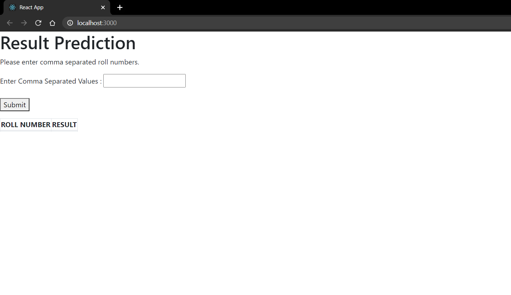
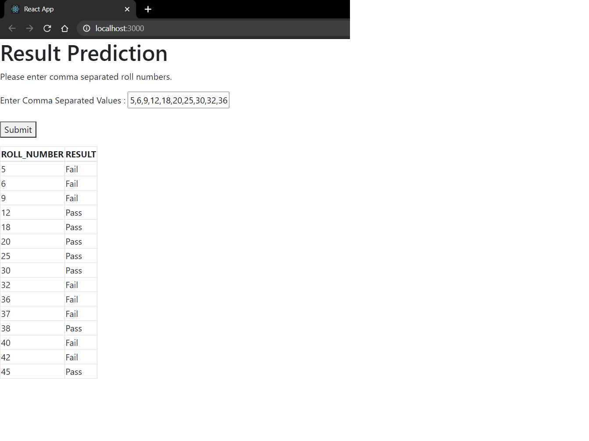
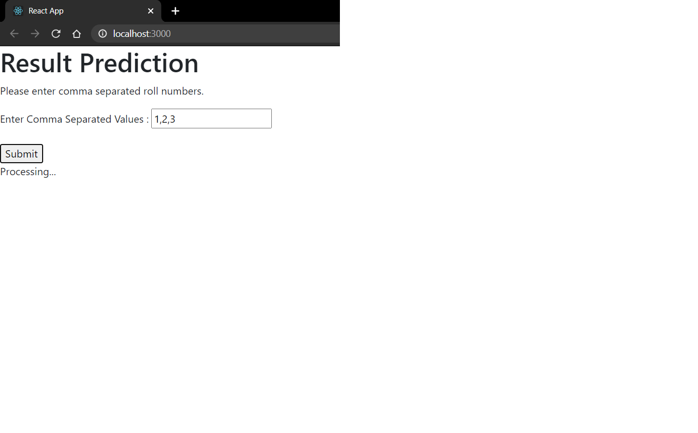

# proedgeAssignment

This repository has 2 folders.
One contains the backend files created in node.js and the other contains frontend files in react.js .

# Backend Code
app.js contains all the logic of the project. 
An API is created which accept post requests from the front end. 
Roll numbers entered at front end are stored in an array and an API call is made for each roll number.
In the API an async function is created which is needed to make multiple API calls. 
Promises are used for making the API calls.
When response is received for all the roll numbers a JSON object is created which is then passed on to the front end.
## To start backend, run the following command
node app.js

# Frontend Code
App.js contains all the logic for the frontend and Table.js is used to create table from the JSON object received from the backend.
The user types in the Roll Numbers separated by a comma and then click submit.
The data is then passed to the backend by making a POST request, which in turn returns a JSON object with the result.
The JSON object is then used to generate the table.

## To start frontend(ensure that backend is running), run the following command
npm start

## Libraries used
1. xmlhttprequest
2. node-fetch
3. cors
4. xpress
5. react
6. bootstrap

# Screenshots

